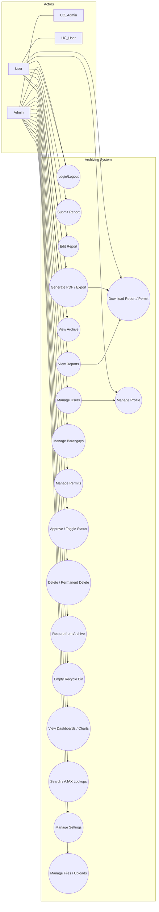

# Use Case Diagram — Archiving System

## PlantUML
Save the following as `use_case_diagram.puml` and render with PlantUML.

```
@startuml
left to right direction
actor Admin
actor User

rectangle "Archiving System" {
  User -- (Login)
  User -- (Logout)
  Admin -- (Login)
  Admin -- (Logout)

  User -- (Submit Report)
  User -- (Edit Own Report)
  User -- (View Reports)
  User -- (Download Report / Permit)
  User -- (View Archive)
  User -- (Generate PDF / Export)
  User -- (Manage Profile)

  Admin -- (Manage Users)
  Admin -- (Manage Barangays)
  Admin -- (Manage Permits)
  Admin -- (Approve / Toggle Status)
  Admin -- (View All Reports)
  Admin -- (Delete / Permanently Delete)
  Admin -- (Restore from Archive)
  Admin -- (Empty Recycle Bin)
  Admin -- (View Dashboards / Charts)
  Admin -- (Export / Generate Reports)
  Admin -- (Search / AJAX Lookups)
  Admin -- (Manage Settings)
  Admin -- (Manage Files / Uploads)
  
  (Manage Users) ..> (Manage Profile) : includes
  (View All Reports) ..> (View Reports) : extends
  (Generate PDF / Export) ..> (Download Report / Permit) : includes
}

@enduml
```

---

## Mermaid
Paste this into a Mermaid renderer (e.g., VS Code Mermaid preview).



---

## Mapping: use cases → representative files
- Authenticate (login/logout)
  - `Admin/adminlogin.php`, `Admin/logout.php`, `user/userlogin.php`, `user/logout.php`, `auth_check.php`
- Manage profile
  - `Admin/edit_profile.php`, `Admin/myprofile.php`, `user/edit_profile.php`, `user/myprofile.php`
- Manage users (Admin)
  - `Admin/manageuser.php`, `Admin/manageuser_ajax.php`, `Admin/create_manager.php`, `Admin/add_barangay.php`, `Admin/delete_user.php`, `Admin/edit_user.php`
- Manage barangays (Admin)
  - `Admin/barangay_list.php`, `Admin/add_barangay.php`, `Admin/barangay_ajax.php`, `user/barangay_list.php`
- Submit reports
  - `user/submit_report.php`, `user/upload_report.php`, `Admin/submit_report.php` (admin-side equivalents)
- Edit reports
  - `user/update_fire_report.php`, `user/update_fire_incident_report.php`, `Admin/update_fire_report.php`
- View reports
  - `user/view_report.php`, `Admin/view_report.php`, `fetch_report_details.php`
- Download reports / permits
  - `user/download_report.php`, `Admin/download_report.php`, `download_permit.php`, `downloadArchive.php`
- Generate PDFs / exports
  - `Admin/generate_pdf.php`, `user/generate_pdf.php`, `Admin/generate_all_reports_pdf.php`, `user/generate_all_reports_pdf.php`, `Admin/export_excel.php`, `Admin/export_reports.php`
- Archive / view archives
  - `Admin/archives.php`, `user/myarchives.php`, `get_archives.php`, `downloadArchive.php`
- Restore / delete / empty recycle bin
  - `Admin/restore_report.php`, `Admin/restore_permit.php`, `Admin/permanent_delete_report.php`, `Admin/empty_recycle_bin.php`, `bulk_restore.php`
- Search / AJAX lookups
  - `Admin/ajax_search.php`, `user/ajax_search.php`, `Admin/fire_incident_report_ajax.php`, `Admin/fire_types_ajax.php`
- Manage permits
  - `Admin/generate_permit.php`, `Admin/edit_permit.php`, `Admin/delete_permit.php`, `Admin/download_permit.php`
- Manage settings (Admin)
  - `Admin/setting.php`, `Admin/settingstyle.css`, `toggle_status.php`
- View dashboards / charts / monthly reports
  - `Admin/admindashboard.php`, `Admin/monthly_reports.php`, `Admin/monthly_reports_chart.php`, `user/monthly_reports.php`
- Manage files / uploads / photos
  - `Admin/delete_photo.php`, `Admin/delete_report_file.php`, `upload_report.php`, `uploads/` directories

---

If you'd like, I can also render the PlantUML file to PNG/SVG and save it in the workspace (requires PlantUML or an online renderer). Do you want me to generate images too?